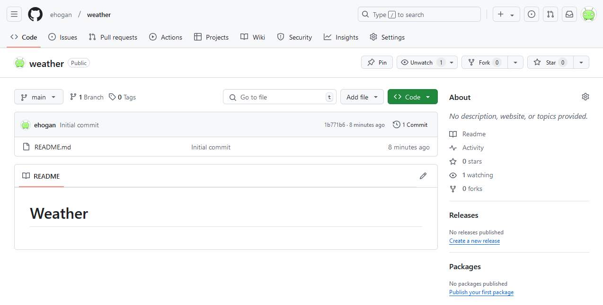

::::::::::::::::::::::::::::::::::::::: objectives

- Recognise and use Git commit unique identifers.
- Compare various versions of tracked files.

::::::::::::::::::::::::::::::::::::::::::::::::::

:::::::::::::::::::::::::::::::::::::::: questions

- How can I identify old versions of files on GitHub?
- How do I review my changes on GitHub?

::::::::::::::::::::::::::::::::::::::::::::::::::

## Viewing a Repositories History on GitHub

In an earlier episode,
we used `git log` on the command line in our local repository
to show the commits to our branch.

We can also see these changes on GitHub.
But first we need to push our local branch to GitHub.

Make sure you are still on the `forecast` branch:

```bash
$ git switch forecast
```

Now we can push our local branch to GitHub:

```bash
$ git push
```

Navigate to your `weather` GitHub repo:

{alt='A screenshot of the main branch of weather repository on GitHub.'}

Select the `forecast` branch from the branch drop down box:

{alt='A screenshot of the main branch of weather repository on GitHub, showing the branch drop down box.'}

Click on `commits`:

{alt='A screenshot of the forecast branch of weather repository on GitHub, showing how to navigate to the commits.'}

This commits page shows all the commits on your branch:

{alt='A screenshot of the commit on the forecast branch of the weather repository on GitHub.'}

The Git commit unique identifiers here on GitHub
match with those shown after running `git log` on the command line
in your local branch.
